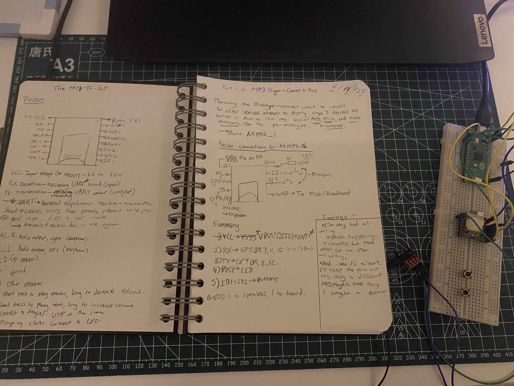

# June 11 - Entry #1 

I've made several different tweaks and such on this project, but I've never got it properly working yet, though. So, I'm starting with a bit of a pre-prototype, seeing how the heart of this project - the mp3-tf-16p - works in of itself. 

Time: ~1 hour, 15 minutes.

-----

## MP3 TF 16P Pinout

As seen in the journal, I've described the different functions of the pins on the DFPlayer. However, the ones of interest to me in this project will be:

- VCC (duh!!)
- RX: UART signal - connect to TX
- TX: UART Signal - connect to RX
- DAC_R: for Earphone Jack
- DAC-L: for earphone jack
- possibly IO1 & IO2

## Findings
- I'm pretty bad at wiring! 
    - As I ran the RAMP3_1 code, I could only hear clicks and beeps from the dfplayer - most likely error signals. I was lost for a good 45 minutes, fixing up the code, reviewing my circuitry on *paper*, reducing noise - but I failed to check the actual connections on the breadboard.
- Since the journal had the player facing down, and i connected it facing up, I put all the signals on the *wrong side*. 
- Good news is I fixed up the wiring and those error noises stopped. Bad news is that I still can't hear any songs playing.
    - incase I fried the poor thing, I got an extra DFplayer and 2 extra picos. Learned my lesson...
